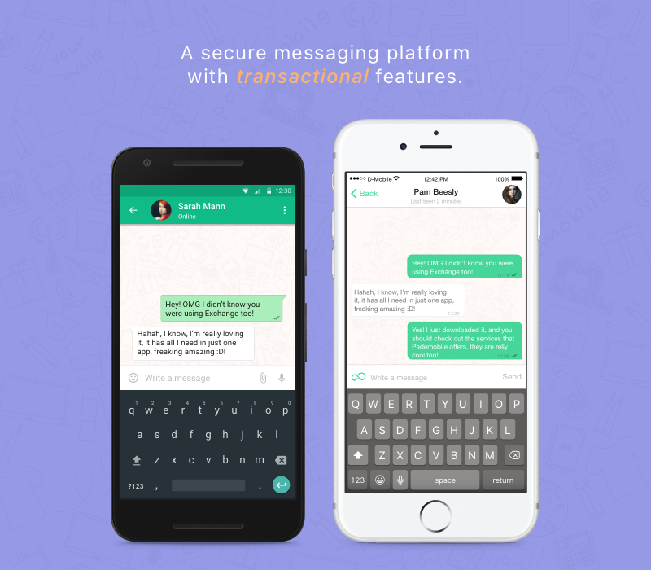
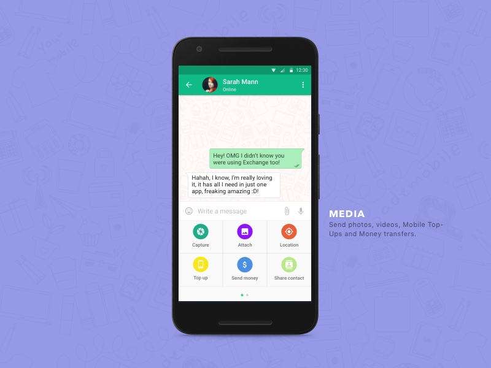
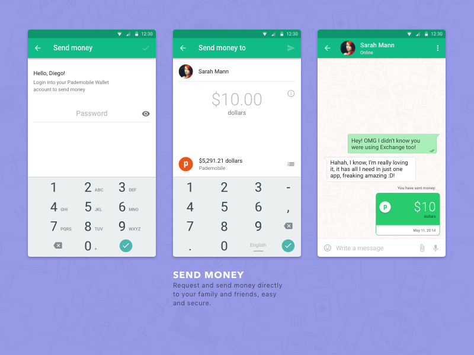
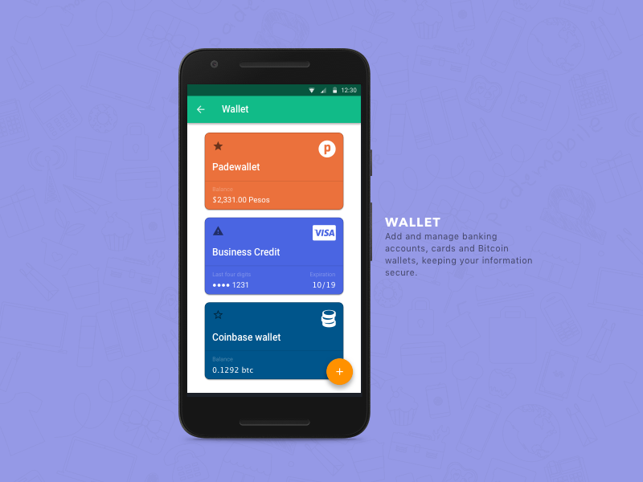

**Location** : Mexico City, Mexico

**Industry:** Technology, Communication

**Role**: UX Designer

**Promotional video**:
[Promo Video](http://www.youtube.com/watch?v=j3_AM5EXNeM&t=1s "Promo Video")

**App**: [iOS](https://itunes.apple.com/us/app/exchange-messenger/id876639985?mt=8)

**Twitter Account**:
[@Exchangeapp](https://twitter.com/exchangeapp "@Exchangeapp")

---

# The Problem
The challenge at Pademobile (a fintech startup) was designing products for financial inclusion in a country where less than the 50% of the population had a bank account. This involved months of user research, prototyping, and testing web/mobile applications. The platform peaked at 5M users across Mexico and Spain.

---

#toolkit:
Sketch, Adobe Illustrator, InVision, Framer,   

Surveys, 1:1 interviews, A/B Test

---

## Thanks for reading!

[Back to Portfolio](/portfolio)

