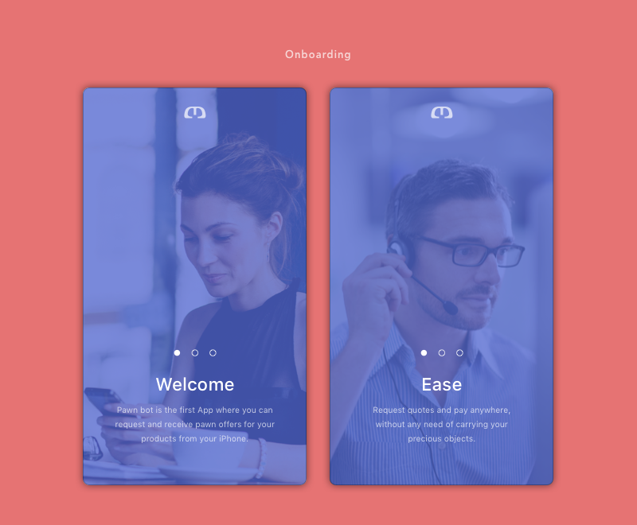
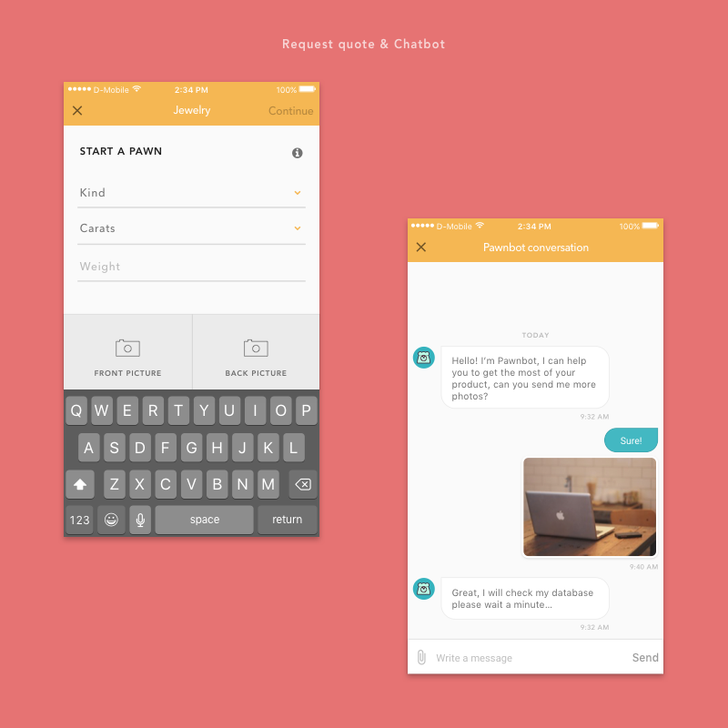
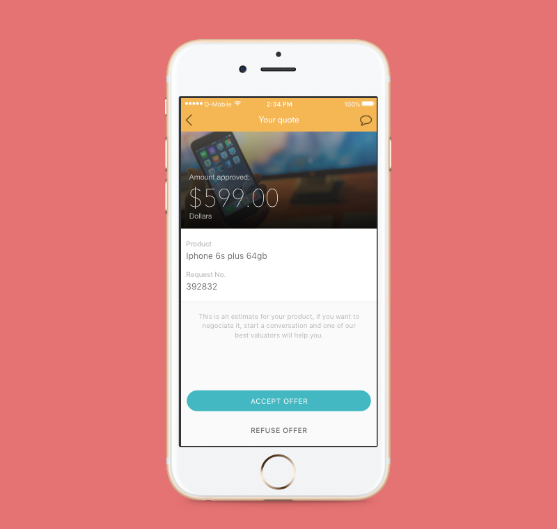

**Location** : Mexico City, Mexico

**Industry:** Technology

**Role**: Product Designer

**App**: [iOS](https://itunes.apple.com/us/app/prestam%C3%B3vil/id1112275165?mt=8)

---

# The Problem

MLS provides financial services to individuals in Mexico, one of our collaborations with their innovation team was to create an app where customers could pawn items from their phone.

It was a full process collaboration, since the conception of the idea, to the research phase, the design of the product and the launch to the market.

My role was to define the product vision, managing stakeholder expectations, prototype design, handoff Product Requirement Documents and digital assets to their developers.

---

#toolkit:
Sketch, InVision, Zeplin, Confluence

Focus group, Surveys, A/B Test

---

## Thanks for reading!

[Back to Portfolio](/portfolio)

