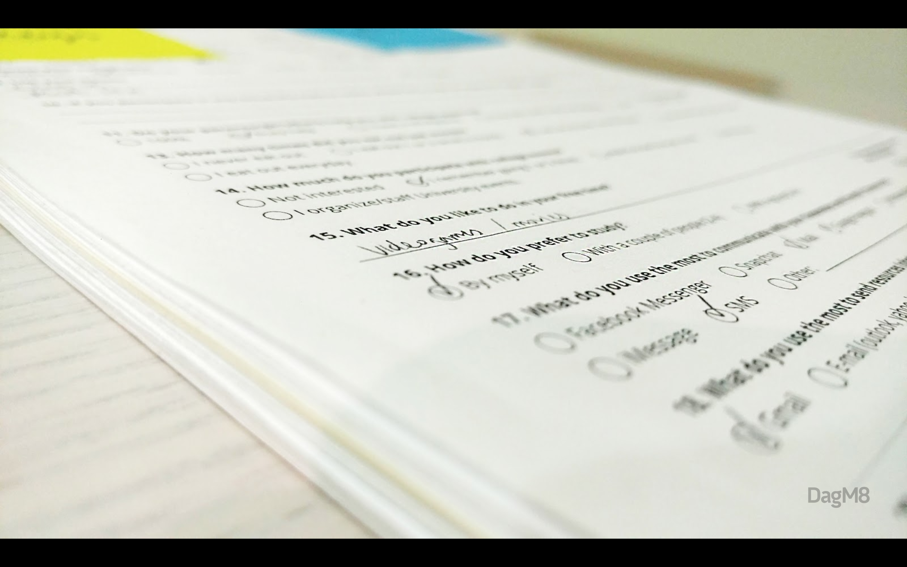
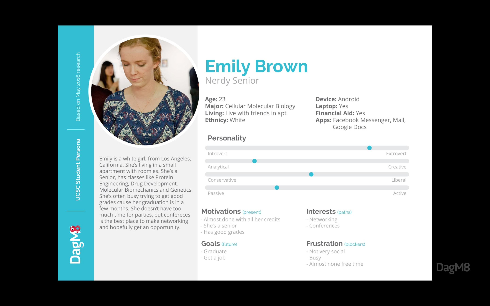
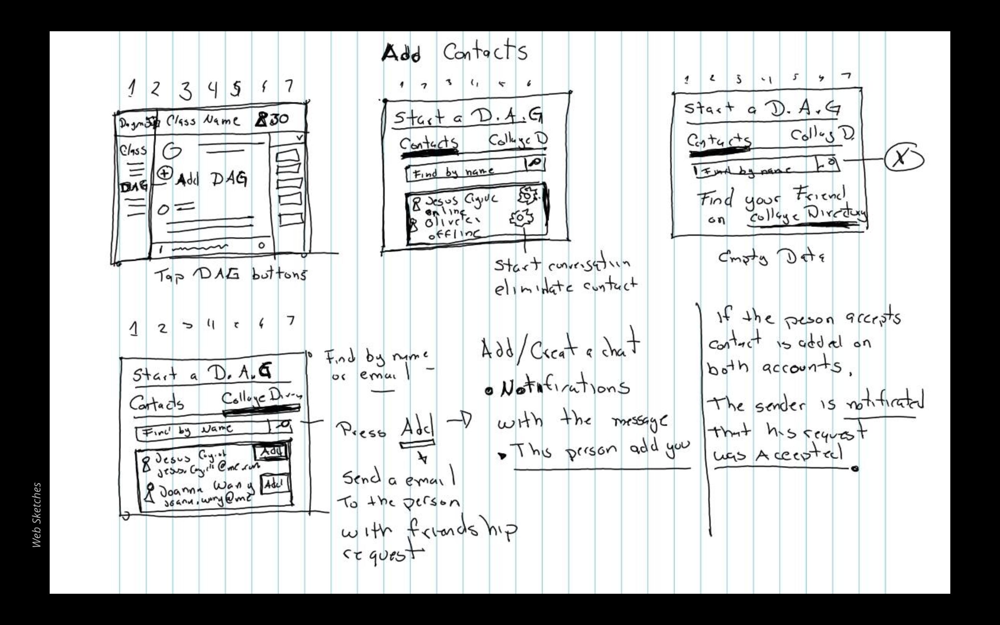
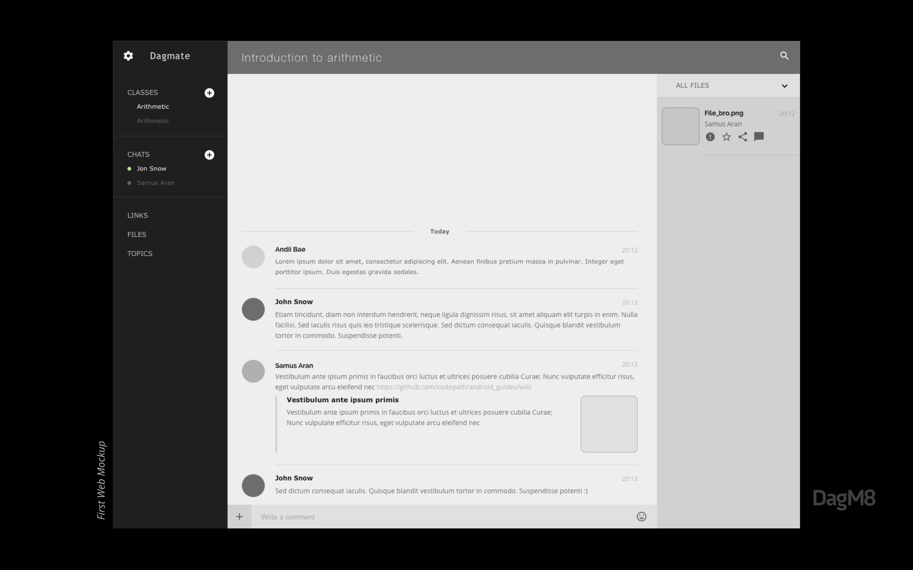
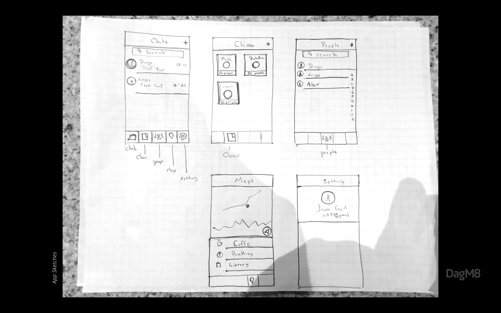
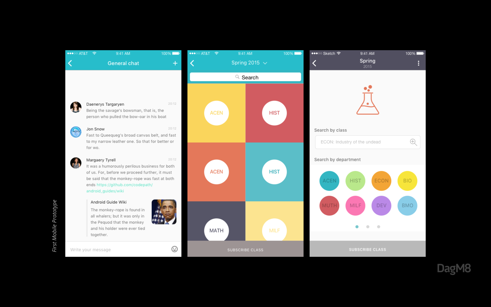
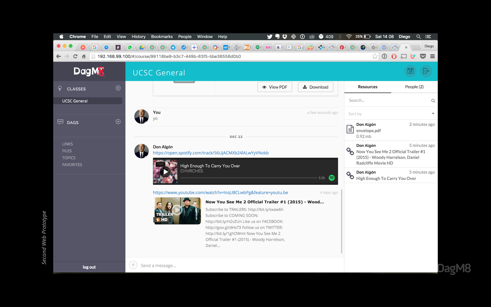
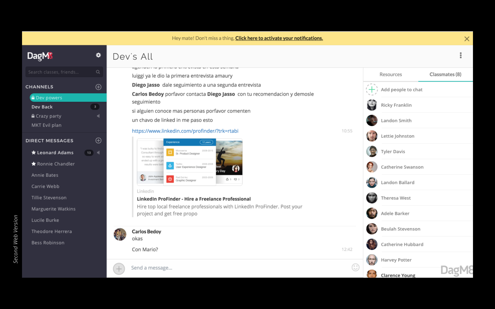
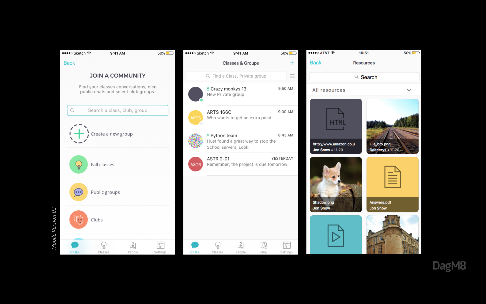

**Location** : Santa Cruz, CA, United States

**Industry:** Education, communication

**Role**: Product Designer

## [Visit Dagm8 Website →](https://www.dagm8.com/)

---

# The Problem
It's a surprise for no one the struggle students face in college with swelling class sizes, the lower quality of T.A.-taught classes, and increasing tuition costs and debt.
DagM8 was created as a collaboration platform to connect students closer with their classmates and teachers, the final goal: overcome college together. DagM8 Founding team had so many ideas and assumptions on how to tackle those problems and help students to improve their college experience. The initial hypothesis: Students need more resources, but educational platforms are not engaging, and social networks are not educational. 

My role was helping the team to understand the impact of measurable design, and kickstart a unified vision of their digital products across devices (Native Mobile vs Desktop Web)

*After visiting UCSC we identified some real life issues students face everyday*

---

# Actions
 We decided to start with an experiment at UCSC. We reached students to personally hear their struggles, empathize with their goals and understand how they collaborate with other students. This helped us to create our main personas, allowing us to pin point key factors and create segments.

 |  
--- | ---

The results from surveying students helped us to prioritize the features the app would focus on, and weed out those that wouldn't be meaningful for the targeted segment.

After defining specific product goals, aiming specific target issues it was easier to work a first sketch of the app, and how we could boost students collaboration. 

 | 
--- | ---
 | 

We tested the prototypes with students, mainly to understand how they would interact with the platform. this helped us to create an affinity map to make a path of completed and no-completed task from our interviewed customers. This way we could measure what is working and what’s not.

# Solution
We focused DagM8 as a hyper-collaboration platform and social network for colleges, where students can extend class discussions in the same place they find events and parties; a one-stop-shop for students’ communication and collaboration where their school and social lives coexist.

*One of the early development previews of the web platform*

---
# The Results
The original DagM8 app was overloaded with a variety of features (chat, geo-location, check-in, feeds, stickers, etc) this made the app hard to use. This also made hard to define significative metrics to measure the success of the platform. 
As result of our sprint, we created an MVP platform, we validated our market fit and corrected our initial assumptions, the project has been founded and still running strong.

*Final Desktop Version*

*Final Mobile Version* 

# Learnings

- Don't overestimate the value of early test prototypes with your customers. This will allow you to change the course before the developers get to code anything.

- It's ten times easier to propose a feature change when you have metrics to understand the impact and performance it has over a period of time. 

---

#toolkit:
Sketch, Adobe Illustrator, InVision, Zeplin, Framer, Sendgrid, GA, Hotjar

Focus group, Surveys, 1:1 interviews, A/B Test

#Product Team:
[@andiimacias](https://dribbble.com/andiimacias), [@JesusCagide](https://twitter.com/JesusCagide)

---

## Thanks for reading!

[Back to Portfolio](/portfolio)

