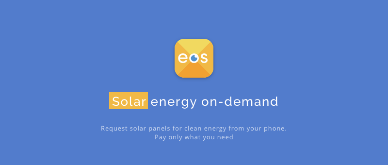
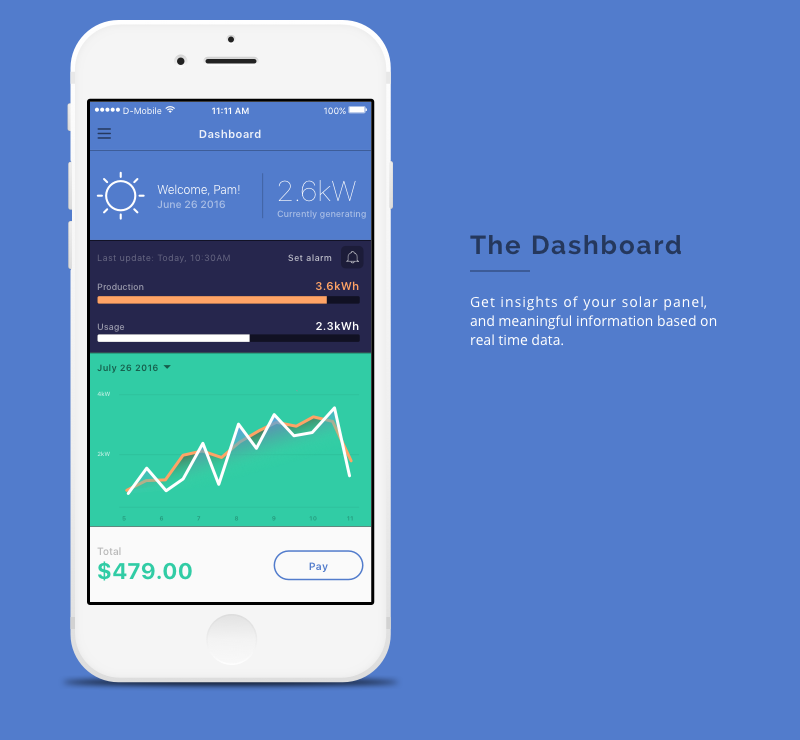
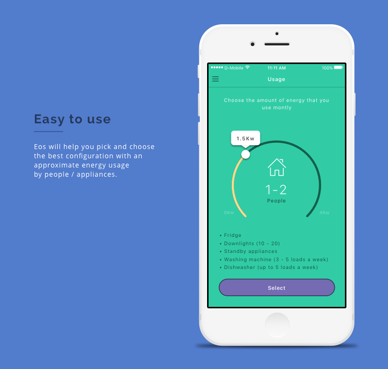
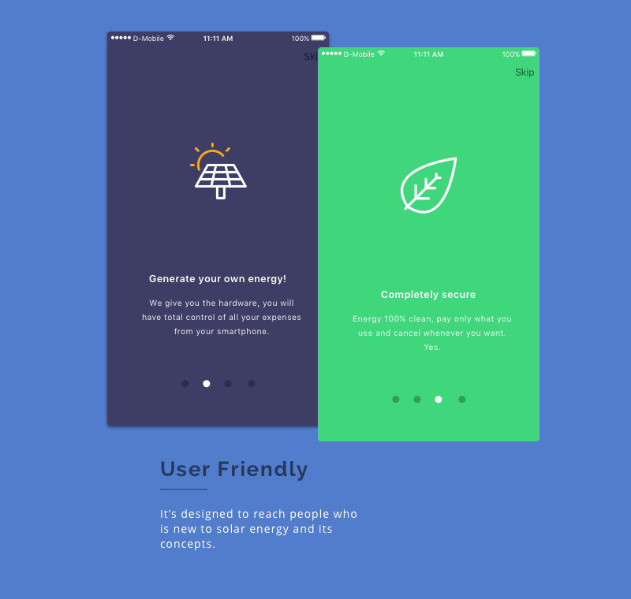
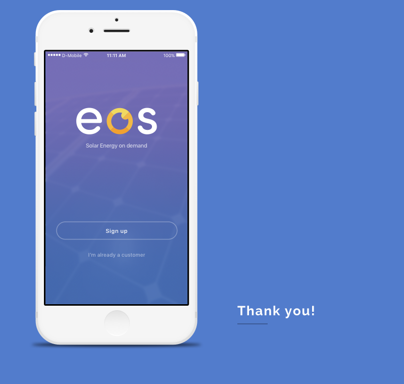

**Location** : Guadalajara, Mexico

**Industry:** Technology

**Role**: Product Designer

---

# The Problem

*This was a Hackathon project*. The goal was to create an app that would use Paypal's payment gateway. We decided to approach from a different perspective to create a prototype of a service that would integrate IoT and offer a solution for people who wanted to try clean energy at home. 

During the hackathon we had to create the project with a realistic approach. 

My activities were to research the current energy market in Mexico, the regulations and the existent alternatives. Working closely with a developer to ensure that every spec of the product would be executable in a real life project. 

After a series of fast-prototyping we developed a mock interface and a more detailed UI.

---

#toolkit:
Sketch, InVision, Zeplin, XCode

---

## Thanks for reading!

[Back to Portfolio](/portfolio)

